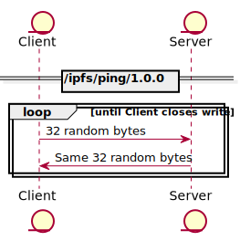

# Ping <!-- omit in toc -->

| Lifecycle Stage | Maturity                 | Status | Latest Revision |
| --------------- | ------------------------ | ------ | --------------- |
| 3A              | Recommendation | Active | r0, 2022-11-04  |

Authors: [@marcopolo]

Interest Group: [@marcopolo], [@mxinden], [@marten-seemann]

[@marcopolo]: https://github.com/mxinden
[@mxinden]: https://github.com/mxinden
[@marten-seemann]: https://github.com/marten-seemann

# Table of Contents <!-- omit in toc -->
- [Protocol](#protocol)
- [Diagram](#diagram)

# Protocol

The ping protocol is a simple request response protocol. The client opens a
stream, sends a payload of 32 random bytes, and the server responds with the
same 32 bytes on that stream. The client then measures the RTT from the time it
wrote the bytes to the time it received the bytes. The client MAY repeat the
process by sending another payload with random bytes on the same stream, so the
server SHOULD loop and echo the next payload. The client SHOULD close the write
side of the stream after sending the last payload, and the server SHOULD finish
writing the echoed payload and then exit the loop and close the stream.

The client MUST NOT keep more than one outbound stream for the ping protocol per
peer. The server SHOULD accept at most 2 streams per peer since cross stream
behavior is not linearizable for client and server. In other words, the client
closing stream A and then opening stream B, might be perceived by the server as
the client opening stream B and then closing stream A.

The protocol id is `/ipfs/ping/1.0.0`.

# Diagram



<details>
  <summary>Instructions to reproduce diagram</summary>

From the root, run:  `plantuml -tsvg ping/ping.md`

```
@startuml
skinparam backgroundColor white

entity Client
entity Server

== /ipfs/ping/1.0.0 ==
loop until Client closes write
    Client -> Server: 32 random bytes
    Client <- Server: Same 32 random bytes
end
@enduml
```

</details>